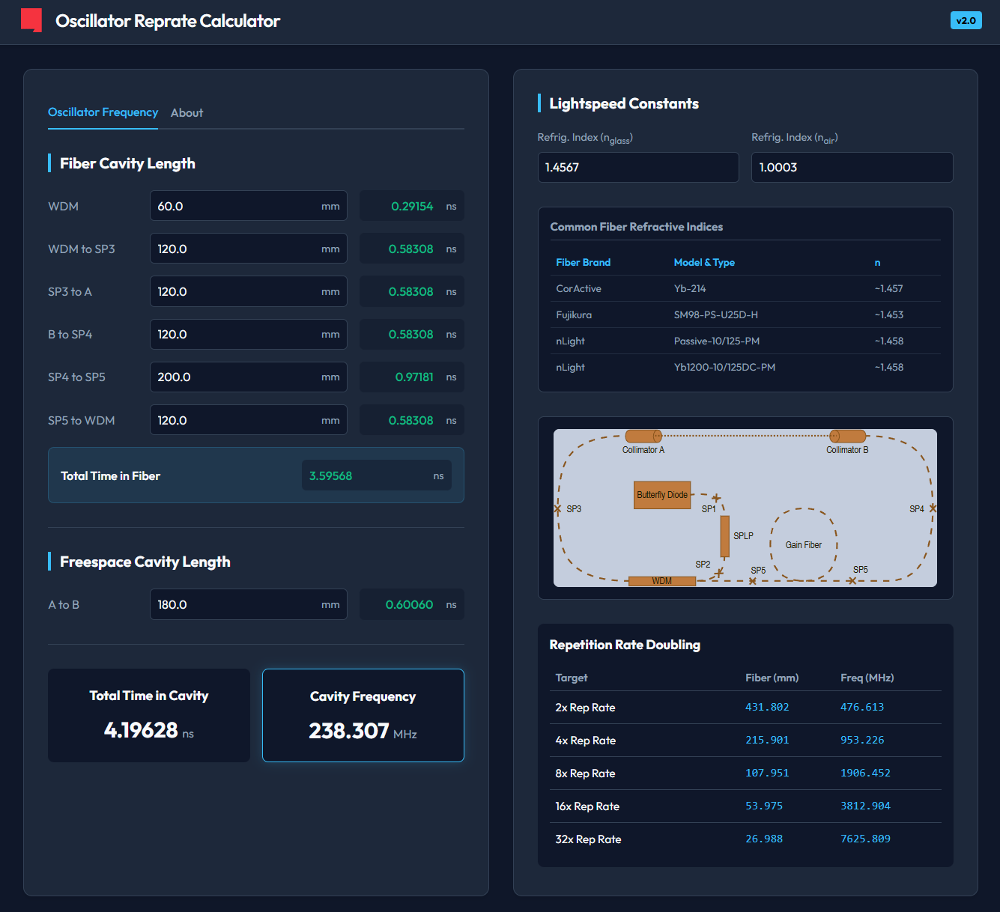

# Oscillator-Reprate Calculator v2.2


*(Click to view interactive diagram in the web app)*

## 🚀 Overview

**Oscillator-Reprate Calculator** is a specialized precision tool designed for laser physicists and optical engineers. It allows for the rapid calculation of fiber laser oscillator properties, specifically focusing on **cavity frequency**, **total time**, and **input/output fiber lengths** required for repetition rate doubling.

Unlike basic calculators, this tool accounts for the different **refractive indices** of fiber and air, ensuring high-accuracy results for free-space and fiber-coupled segments.

## ✨ Features

-   **Precision Calculation**: Computes total cavity time (ns) and frequency (MHz) based on individual fiber segment lengths (mm) and free-space paths.
-   **Refractive Index Support**: Input specific refractive indices ($n_{glass}$ and $n_{air}$) for accurate speed of light calculations ($c/n$).
-   **Reference Table**: Built-in quick reference for common fiber types (CorActive, Fujikura, nLight).
-   **Repetition Rate Doubling**: Automatically calculates the required fiber lengths to achieve $2x, 4x, 8x, 16x$ repetition rates.
-   **Modern Web UI**: A clean, dark-themed responsive interface with real-time updates.
-   **Zero Installation**: Runs entirely in the browser as a single-page application.

## 🛠️ Usage

1.  **Open the App**: Simply open `index.html` in any modern web browser.
2.  **Configure Constants**:
    *   Enter the **Refractive Index** for your fiber (e.g., `1.45`).
    *   Enter the **Refractive Index** for air (e.g., `1.0002`).
3.  **Input Lengths**:
    *   Enter the lengths of your fiber segments in **millimeters (mm)**.
    *   Enter the free-space path length in **millimeters (mm)**.
4.  **View Results**:
    *   **Total Time**: The round-trip time of the optical pulse in nanoseconds.
    *   **Cavity Frequency**: The fundamental frequency of the oscillator in MHz.
5.  **Multiplier**: Check the bottom table for the exact fiber lengths needed to multiply the repetition rate.

## 📦 Installation & Release

This project is now a **Web Application**. You do not need to install Python or any dependencies.

### Running Locally
1.  Clone the repository:
    ```bash
    git clone https://github.com/Alptknt/Reprate_Calculator.git
    ```
2.  Open `index.html` in your browser.

### Releases
Download the latest version from the [Releases Page](../../releases).
*   **v2.0**: The complete Web Application overhaul (HTML/CSS/JS).


